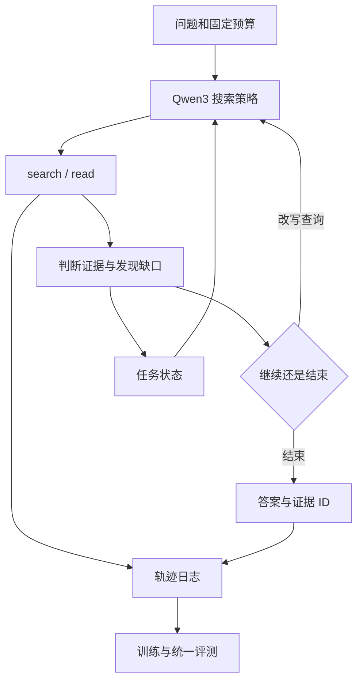

> 项目目标：完成一个**能够多轮搜索、判断证据并纠正错误路径的文本搜索 Agent**，展示数据处理、Qwen3 后训练与工程实现能力。
>
> 基座默认 **Qwen/Qwen3-4B**；参考论文为 Search-R1、ReSeek、Agentic-R、RE-TRAC、MiroFlow。服务器：8×NVIDIA L40S，每卡显存 47.99G；torch 2.6.0、veRL 0.5.0、vLLM 0.8.4。
>
> 本版以项目效率为原则：一个主数据集、一个主模型、四个系统版本、一套固定评测。保留必要的数据和正确性检查，实验集中在主干。本文仍是实施指导，未在服务器执行训练或评测；数据规模和配置是建议。

# 1 训这个模型，是为了解决什么问题

建议项目名称：**面向多跳信息搜寻的证据驱动搜索 Agent**。

目标是在信息不完整、检索结果有干扰时，让模型学会：**发现缺少哪条证据、形成下一次查询、发现错误路径后补查，并输出有依据的答案**。

示例任务：

> “人物 A 就读学校的创办者出生于哪个城市？”

模型可能先查学校，再确认创办者，最后查询出生地。如果第一轮结果只有现任负责人，应该识别它没有提供所需关系，而不是直接拿来回答。例子只说明任务结构，实际问题和答案来自可核验数据。

项目主线：


研究思路是：**在固定预算内，依据证据缺口与失败原因推进搜索。** 项目证明范围是当前数据与环境下的效果，不以完成精细的论文级归因为目标。

# 2 JD 决定能力要求，任务由项目决定

| 岗位能力 | 项目中的体现 |
|---|---|
| 复杂意图理解与规划 | 根据多跳问题及中间证据生成后续查询 |
| Tool Use 与多轮交互 | search、read、判断、补查、结束 |
| 数据构建与后训练 | QA 转搜索任务、困难样本、必要 SFT、GRPO |
| 反思纠错与上下文管理 | 无用证据识别、查询改写、结构化探索状态 |
| 搜索算法与工程实现 | 检索器接入、服务、轨迹记录、模型部署和评测 |

任务采用开放域文本多跳问答。多轮工具交互和任务内状态是主线；用户长期画像、真实 Web 部署及多模态不进入本版交付要求。

# 3 五篇论文的投入方式

| 论文                | 在项目中借鉴什么                       | 实际投入                   |
| ----------------- | ------------------------------ | ---------------------- |
| ==**Search-R1**== | 多轮检索进入 RL rollout、检索返回 masking | Qwen3-4B 搜索策略训练底座      |
| ==**ReSeek**==    | 判断证据、识别并恢复错误搜索路径               | 加入判断动作和困难任务，形成纠错增强版本   |
| ==**Agentic-R**== | 根据任务效用改善检索                     | 构造查询—证据正负例，做一次小规模检索器优化 |
| ==**RE-TRAC**==   | 用已有证据与失败记录指导后续探索               | 接入结构化状态；使用同一个 Qwen3 后端 |
| **MiroFlow**      | 工具组织、可靠执行与轨迹运行                 | 文本工作流、有限重试、日志和演示       |


官方入口：

- Search-R1：[论文](https://arxiv.org/abs/2503.09516)｜[代码](https://github.com/PeterGriffinJin/Search-R1)
- ReSeek：[论文](https://arxiv.org/abs/2510.00568)｜[代码](https://github.com/TencentBAC/ReSeek)
- Agentic-R：[论文](https://arxiv.org/abs/2601.11888)｜[代码](https://github.com/8421BCD/Agentic-R)
- RE-TRAC：[论文](https://arxiv.org/abs/2602.02486)｜[代码](https://github.com/microsoft/InfoAgent/tree/main/retrac)
- MiroFlow：[论文](https://arxiv.org/abs/2602.22808)｜[代码](https://github.com/MiroMindAI/MiroFlow)

五篇论文共享一份数据、一套工具和评测协议。主训练是搜索策略与纠错；检索器顺序优化一次，状态继承和工作流主要在推理层接入。完整协同训练、原论文模型重训和逐项机制消融不作为验收条件。

如果某仓库整体接入成本过高，提取需要的机制，通过统一接口实现。报告明确哪些是原代码复用、哪些是项目迁移或自实现。

# 4 主模型：固定 Qwen3-4B

默认使用 **[Qwen/Qwen3-4B](https://huggingface.co/Qwen/Qwen3-4B)**，先固定这一公开后训练版本及 revision。4B 适合本机推进训练与调试；Qwen3-8B 作为完成项目后的可选升级，不安排模型规模对照。

为控制生成长度与适配成本，**默认统一使用非思考模式 `enable_thinking=False`**。SFT 数据处理、训练 rollout、提示词基线和最终服务采用相同聊天模板及模式；不另做 thinking／non-thinking 实验。多轮工具决策仍由模型完成。

官方模型卡说明 Qwen3 需要支持该架构的 Transformers，低于 4.51.0 会出错，并推荐 vLLM≥0.8.5。固定版本 vLLM 0.8.4 注册表已有 Qwen3 入口，但入口存在不保证完整运行链路兼容。[官方模型说明](https://huggingface.co/Qwen/Qwen3-4B)、[vLLM 0.8.4 注册表](https://github.com/vllm-project/vllm/blob/v0.8.4/vllm/model_executor/models/registry.py)

实施顺序：核对 Transformers／模板 → 在现有环境验证生成、工具调用与权重更新 → 只有遇到明确问题，才在独立环境试兼容版本并记录实际依赖。**当前版本先验证，不无条件升级。** Qwen3.5 和 Qwen3 MoE 不在本版模型范围内。

# 5 数据选择：一条主线即可

## 5.1 默认采用 2WikiMultiHopQA

主数据集选择 **2WikiMultiHopQA**：其问题、支持事实和关系三元组有助于定位“上一跳得到什么、下一跳还缺什么”。先把这一数据源处理扎实，再训练和评测。[官方数据与字段说明](https://github.com/Alab-NII/2wikimultihop)

建议起步规模：训练 2,000–5,000 题，开发约 200 题，冻结测试约 300 题。先用 30–50 题打通解析、证据映射与工具；扩大规模前抽查标签。数字为项目预算建议，不代表原论文设置。

从官方训练集准备训练／开发数据，使用有公开标注的官方开发集抽取项目测试集，并记录原 ID。测试只用于最终评测，训练与检索器标签都不使用测试答案。

## 5.2 其他数据源作为备选

HotpotQA 可在 2Wiki 数据获取或解析受阻时作为替代起点；MuSiQue、FictionalHot 留待项目完成后扩展。本版不要求多数据源混训、跨数据集泛化或抗污染压力测试。

资源：[HotpotQA](https://hotpotqa.github.io/)｜[MuSiQue](https://github.com/StonyBrookNLP/musique)｜[FictionalHot](https://huggingface.co/datasets/TencentBAC/FictionalHot)

## 5.3 固定共享语料

将选定样本的上下文段落去重并构建共享库，加入固定背景段落，供所有版本调用。同一份库、切分规则和索引版本贯穿训练与评测。

用于支持测试题的原始事实可以存在于检索库；测试问题、答案、支持标签和标准分解不能进入 Agent 的提示或工具返回。这里是在本项目构建的共享语料上搜索，结果不能直接作为原数据集原设置的榜单成绩。

第一版只使用有支持证据的可解任务。检索失败时允许说明证据不足，但不额外构建“不可解”数据或拒答训练：语料缺证据、切段丢证据属于数据问题，应先修复。

# 6 数据处理：保留逻辑，减少分支

数据处理是项目核心，必须回答“这一步处理要帮助模型学会什么”。完成以下六步即可。

| 步骤            | 处理逻辑                       | 产出／必要检查                  |
| ------------- | -------------------------- | ------------------------ |
| **1. 标准化与去重** | 统一问题、答案、段落与原 ID；派生样本跟随原题划分 | QA 文件、语料、split 清单与去重统计   |
| **2. 证据映射**   | 将支持事实／三元组对应到文本，切段后保留定位     | 证据 ID、关系映射；检查关键证据仍在库中    |
| **3. 筛选训练题**  | 保留确有中间关系、标签可靠、长度可处理的问题     | 保留／删除理由，人工抽查 30–50 题     |
| **4. 构造困难返回** | 只做“相关但无用”和“首次缺关键证据”两类      | 正确证据后续可达，保存原题与扰动规则       |
| **5. 构造检索对**  | 已知关系证据作正例，相近但无用片段作负例       | 查询—正例—负例，少量误标抽查          |
| **6. 整理轨迹**   | 保存查询、返回、判断、答案、预算；筛选可用示范    | RL 问题集、必要 SFT 轨迹、接受／拒绝统计 |


### 6.1.1 困难样本为什么这样做

“相关但无用”训练模型发现返回没有解决当前关系；“首次缺关键证据”训练模型继续查询，而不是根据不完整信息猜答案。两类都保留正确答案及可获取证据，不增加实体伪造、复杂冲突或系统故障模拟。

首次返回扰动采用固定规则和种子，后续查询仍按公开工具规则运行；不要用隐藏答案控制后续返回。训练中混入一部分困难 episode，原始问题与扰动样本不跨 split。

检索器正负例仅用训练题构造。未标为 gold 的段落不自动当负例，因为可能存在等价证据；抽查后筛选。推理时子查询由 Agent 生成，标准分解只用于训练监督。

### 6.1.2 必须保留的质量底线

- 问题有可靠答案，支持证据能在实际检索库中定位。
- 原题及其改写／扰动版本不跨训练与测试集。
- 答案、支持标签和参考轨迹不进入 Agent 可见资料。
- SFT 轨迹工具格式有效，答案正确且有相应证据；自述推理不能自动当金标准。

这些是运行正确性的检查，不另设实验线。难度主要通过少量基线失败案例理解；不要求构建完备依赖图、多个泛化划分或完整污染检测体系。

# 7 系统与工程接口



| 接口／动作 | 要求 |
|---|---|
| `search(query, top_k)` | 返回段落 ID、标题、原文；不返回 gold 标记 |
| `read(passage_id)` | 返回原文与可定位句子；访问规则固定 |
| 判断／补查动作 | 指出当前证据解决了什么、还缺什么、下一次查什么 |
| 结束动作 | 标准答案格式与证据 ID；便于评分和展示 |

Qwen3 文本输出统一解析工具动作，不必依赖完整原生 tool-call／reasoning parser。先接 search，有需要时增加 read；所有正式版本保持相同工具能力。

任务状态只存：已确认事实、未解关系、证据 ID、失败查询、下一步计划。通过证据 ID 回溯原文。RE-TRAC 思路用于带状态继续探索；不额外训练摘要模型，不进行摘要策略比较。

MiroFlow 负责文本运行与工具接入。加入基本超时、有限重试和轨迹回放即可；不安排故障注入、恢复策略对照、高并发压测或复杂前端。

建议目录：

```text
project/
  configs/          模型、数据、索引、预算与四个版本配置
  data_pipeline/    解析、证据映射、困难样本、检索对与轨迹
  retrieval/        固定检索器与一次优化
  tools/            search / read
  agent/            工具动作、纠错、状态与停止
  training/         veRL rollout、必要 SFT、GRPO 与奖励
  evaluation/       同一评测集、评分与结果汇总
  demo/             文本交互和轨迹回放
  reports/          数据说明与主干实验报告
```

# 8 训练安排与简单奖励

## 8.1 只保留两条策略训练主线

**第一条：基础 GRPO。** 固定初始检索器，用 Qwen3-4B 学习搜索—读取—回答，得到 V1。优先直接试 RL；若工具格式明显不稳定，补一次小规模 SFT。报告实际使用了 SFT＋RL，避免把组合效果全部归因于 RL。

**第二条：纠错增强。** 在 V1 基础上加入判断动作和困难 episode，继续训练得到 V2。借鉴 ReSeek 的判断与恢复思路，先不完整复制其密集过程奖励。V2 对比 V1 表示“纠错增强方案”的效果，不单独区分数据、动作和继续训练的贡献。

控制两次训练的规模，先用少量更新确认 rollout、奖励与参数更新正确，再扩大一次。选择检查点用开发集，不要求多个模型规模、多随机种子或多轮超参数搜索。

## 8.2 终局奖励优先

第一版用归一化后的答案 token F1，格式无法解析时给 0：

$$
R = \begin{cases}
\operatorname{F1}(\hat a,a), & \text{答案格式有效}\\
0, & \text{否则}
\end{cases}
$$

$\hat a$ 是模型最终答案，$a$ 是参考答案；F1 衡量归一化后答案 token 的精确率与召回率。复用数据集评分规则，包括别名等实际可用标注。奖励范围为 0–1，便于发现组内是否有区分。

工具／token 成本首先通过固定上限控制，记录但不加复杂奖励项。证据质量先用于数据筛选、引用检查和案例展示；不把模型自称“判断正确”当成奖励。不设置专门拒答奖励、自由文本事实裁判或多项权重搜索。

必要检查：隐藏答案没有泄漏、工具返回 masking 正确、截断轨迹单独记录、奖励不恒定。若答案 F1 无法推动纠错，再根据真实失败增加一个可验证信号；这属于问题驱动的修复，不预先扩展实验矩阵。

## 8.3 最终系统只接入一次增强

冻结 V2，利用训练数据的查询—证据正负例，尝试一次小规模 dense 检索器优化；随后重建索引。接入结构化任务状态，得到 V3。复用现有检索器初始化，不强求 Agentic-R 全量效用标注与交替训练。

若检索优化或状态接入有实现问题，优先修明确错误；不要求为每个模块追加独立消融。最终报告记录实际启用模块，不能把 V3 总体收益单独归因于检索器或状态。

# 9 主干实验：四个版本、一套评测

## 9.1 正式实验只比较四个版本

| 版本 | 内容 | 要回答的问题 |
|---|---|---|
| **V0：提示词 Agent** | 原始 Qwen3-4B＋初始检索器＋多轮工具 | 训练前的可用基线是什么？ |
| **V1：基础 GRPO** | Qwen3 搜索策略后训练，必要时含 SFT | 项目训练方案是否改善搜索任务？ |
| **V2：纠错增强** | V1＋困难 episode＋判断与补查 | 纠错增强版本是否更可靠？ |
| **V3：最终系统** | V2＋一次检索优化＋结构化探索状态 | 最终交付质量与成本如何？ |

这张表就是正式实验范围。训练前可用十几题检查直接回答／一次检索，但不要求形成额外基线表。

**统一条件**：同一 Qwen3-4B 起点、模式、任务集、语料、工具接口与评分器；先固定最多 4 次 search、约 8K 总上下文，实际以配置为准。V3 的状态压缩与再次探索消耗同一总预算，不获得额外调用机会。全部版本记录实际训练量，V2 的继续训练属于其整体方案。

## 9.2 一份测试集、两个结果分组

采用同一冻结测试集的自然 episode，并为其中一个小子集生成可恢复的困难 episode。所有版本使用同样扰动规则与种子，结果分别展示“自然任务”和“困难任务”。无需另建多个数据集。

结果只保留以下主指标：

| 指标 | 用途 |
|---|---|
| **答案 EM／F1** | 任务质量；困难分组使用同样评分 |
| **平均搜索次数** | 是否增加了工具成本 |
| **平均总 token** | 包含状态整理和所有探索尝试 |
| **平均端到端耗时** | 在固定并发下反映本机实际成本 |

保存失败任务与预算耗尽，不只统计成功样本。引用错误与纠错过程抽样查看即可，不要求完整忠实性、停止校准、状态保留率或排名指标体系。

## 9.3 控制实验投入

默认固定一个训练种子和一套训练配置。开发集用于排错和选择检查点；没有新错误，不重复大规模评测。最终跑四个版本，并整理约 10 个有代表性的成功／失败案例。

不安排逐项移除、多种子重复、跨数据集评测、思考模式比较、不同模型规模比较、奖励权重搜索或故障压测。单次项目结果只说明当前配置的表现，不宣称每个模块的独立因果贡献或稳定科研结论。

**思考**：V3 比 V2 更好，能否说明检索器和状态管理都有效？

<details>
<summary><strong>参考分析</strong></summary>

只能说明组合系统在本次测试中更好。项目阶段不做逐项消融，就保留这一结论范围，并通过日志说明实际发生了什么。它足以支持项目展示，无需为证明每个机制而扩大实验。

</details>

# 10 8×L40S 的实施起点

| 环节 | 建议起点 |
|---|---|
| Qwen3-4B 推理 | 1 卡、8K 上下文、并发 1–2、固定非思考模式 |
| Qwen3-4B GRPO | 8 卡 FSDP、BF16、梯度检查点、每卡微批次 1 |
| 初始 rollout | 问题批次 16，每题 4 条，最多 4 次搜索、约 8K 总上下文 |
| 检索器优化／建索引 | 与策略训练顺序执行，不同时占满 GPU |
| 模型与工具服务 | 独立环境，统一 API 和轨迹格式 |

这些是起步估计，未在你的服务器实测。先观察峰值显存与吞吐；显存不足先缩小批次或长度。L40S 无 NVLink，总显存不能看成连续内存。[NVIDIA 官方规格](https://www.nvidia.com/en-us/data-center/l40s/)

vLLM 0.8.4 对 torch 2.6.0 有官方依赖基础，但 Qwen3 聊天模板、Transformers 和论文定制 rollout 仍需验证。[vLLM 固定版本依赖](https://github.com/vllm-project/vllm/blob/v0.8.4/requirements/cuda.txt)

模板中的 `enable_thinking=False` 在数据转换、训练和服务端都要一致；若使用 API，通过对应模板参数传入。解析只取最终答案，不把模板内容或示例答案误当输出。不要为了使用非思考模式而改动参数训练范围或错误屏蔽模型动作。

MiroFlow 客户端可独立部署，避免其 Python 3.12+ 要求改动现有训练环境。[官方安装说明](https://github.com/MiroMindAI/MiroFlow)

首次训练只核验生成工具动作、返回进入下一轮、正确 masking、有效奖励与真实更新。保存源码 commit、依赖、权重 revision、数据／索引版本和结果路径，之后按固定配置推进。

# 11 实施阶段与验收

| 阶段 | 做什么 | 完成标准 |
|---|---|---|
| **0：数据与工具** | 2Wiki 标准化、证据映射、共享库、search／read | 30–50 题抽查通过，标签不泄漏，轨迹可回放 |
| **1：V0 基线** | Qwen3-4B 提示词搜索 Agent | 工具与答案格式稳定，有基线分数及少量失败案例 |
| **2：V1 训练** | 必要 SFT＋一次基础 GRPO | 有真实参数更新，开发集评分可用 |
| **3：V2 纠错** | 两类困难返回、判断动作、继续训练 | 能展示发现缺口并补查，得到纠错增强版本 |
| **4：V3 与交付** | 一次检索优化、任务状态、文本演示 | 四版本统一评测，代码与报告可重跑 |

**最小可交付版本到 V2**：有处理逻辑的数据、一条真实训练链路、纠错增强和主干结果。V3 增强工程与方法深度；若某模块没有收益，记录实际结果，不无限调参。

推进顺序是数据正确 → 工具可用 → 训练有效 → 纠错增强 → 最终系统。数据错误、masking 错误或奖励恒定必须修；没有发现问题的旁支实验不追加。

# 12 最终成果与下一步

交付五项内容：

1. **数据说明**：模型要学什么，为什么选 2Wiki，如何转换、筛选与构造两类困难数据。
2. **代码与配置**：数据、工具、训练、检索、状态与评测入口，统一版本记录。
3. **训练记录**：实际训练量、奖励、参数更新、检查点与运行预算。
4. **主干实验报告**：V0–V3 的质量和成本，约 10 个案例，明确局限。
5. **文本演示**：输入问题，展示查询、证据、补查、状态和答案，可回放。

面试按“问题—数据处理—Qwen3 后训练—纠错—最终系统效果”讲述。只写实际完成的模块与离线结果；没有逐项消融就不单独归因，没有线上实验就不声称业务收益。

**下一步：用 Qwen3-4B 验证现有环境，再解析 2Wiki 的 30–50 题，打通固定语料、工具和 V0。** 通过后扩大一次数据规模，进入 V1／V2 训练。五篇论文始终围绕这条交付主线服务。
